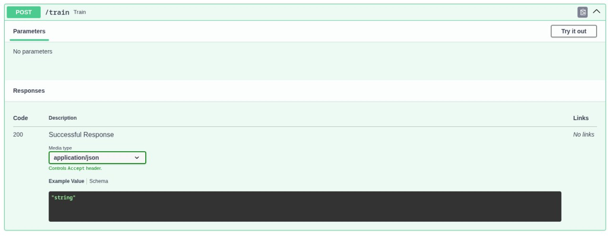
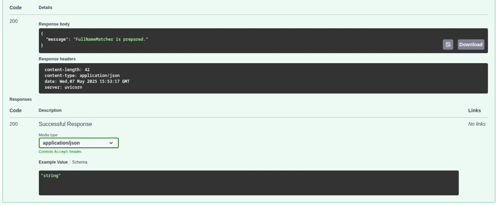
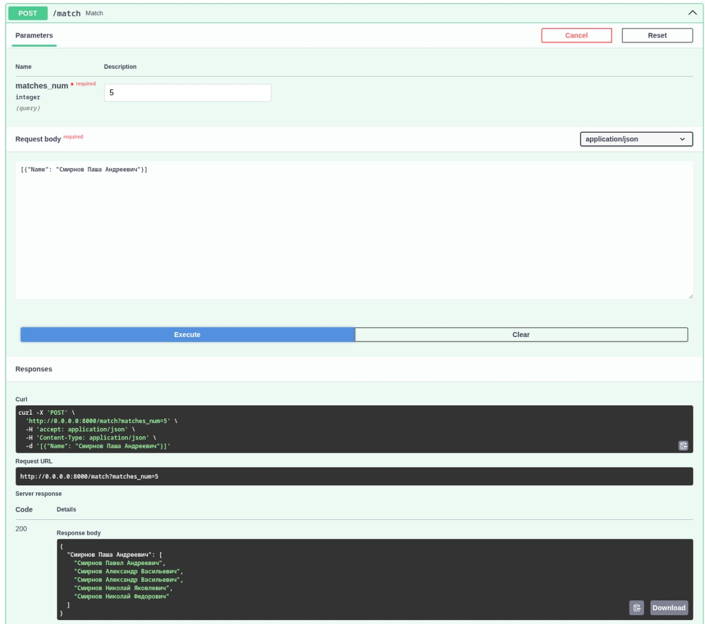

# FullnameMatcher

## Service for matching fullnames

### Tutorial

1. In your directory you need to create a new directory named `data`.

```bash
mkdir data
```

2. It is necessary to move a JSON file with dataset named `dataset.json` to created directory `data`.

Items in JSON file have to include field `Name`. For example:

```python
{
    ...,
    'Name': 'Иванов Иван Иванович',
    ...,
}
```

3. The following step is to pull docker image for `FullnameMatcher` Service.

```bash
docker push noonmare/fullname_matcher:v1.2
```

4. You need to run a docker container with service. 

```bash
docker run -v $(pwd)/data:/app/data -v $(pwd)/logs:/app/logs -p 8000:8000 noonmare/fullname_matcher:v1.2
```

5. After container with service becomes ready for interaction with it is preferably to use FastAPI Swagger. Follow the [link](http://0.0.0.0:8000/docs).

6. First of all, you need to train `FullnameMatcher` Service: your dataset must be processed and Faiss index must be prepared for dataset items embeddings.

You need to click 'Try it Out' and then 'Execute' for `\train` endpoint.



When training is successfully finished message 'FullNameMatcher is prepared.' is provided. 



7. Now you can use service for matching. Endpoint `\match` is used for this. You can note a number of desirable matches and candidates in format:

```python
[{'Name': 'Иванов Иван Иванович'}, {'Name': 'Смирнов Паша Андреевич'}]
```

